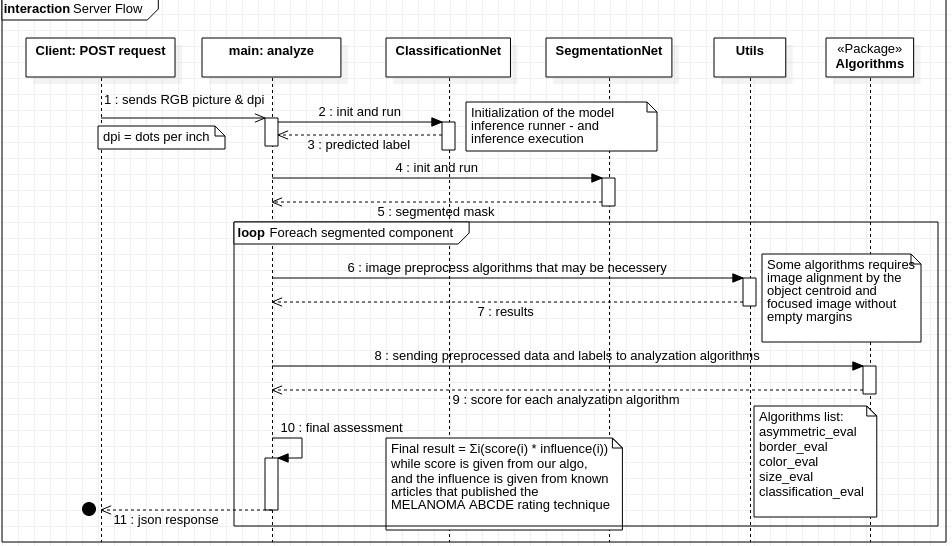
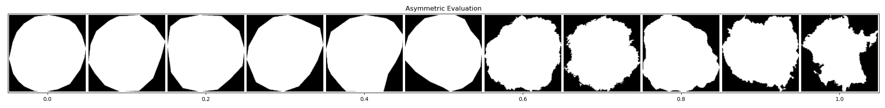
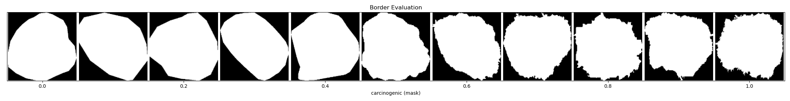
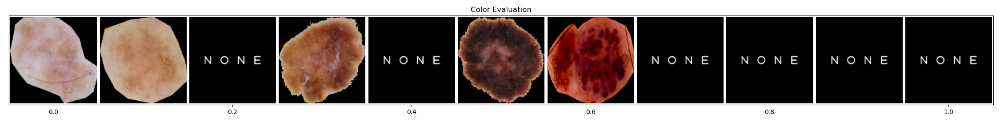

# Skin Detective Back-End

 **The backend application is stateless. it receives an image, analyse it and returns a response in a form of JSON**

## ***Deployment process:***

1. run the setup.sh script file `path/to/file/setup.sh`

**Pre-Conditions:**

* designed for linux-based operation systems.
* docker installed
* default port is 80 - can be changed according to requirements

## ***Usage***

Description: Analyse mole </br>
Usage: POST /api/analyze?dpi=${dpi} </br>
Consumes: image/png </br>
Produces: application/json </br>
Sample Output: </br>

```json
[{
   "asymmetric_score":1.0,
   "border_score":0.2529822128134704,
   "classification_score":0.4663564443588257,
   "color_score":0.027777777777777776,
   "final_score":0.7144696515795925,
   "mole_center":[
      110,
      126
   ],
   "mole_radius":99.36800289831733,
   "size_score":0.1
}]
```

## ***Artificial Neural Networks***

### **Segmentation network**

**Input**: RGB frame(250x250) </br>
**Output**: GrayScale mask(250x250) - every pixel that relates to the skin lesion will be on (value = 255), otherwise off (value = 0)


### **Classification network**

**Input**: RGB frame(250x250) </br>
**Output**: label string - the name of the class that the skin lesion belongs to. we have 9 different categorizations for skin lesions.

#### **Helpful Algorithms**

1. detect the coordinates of skin lesion(s) in a picture.
1. aligning a picture.
1. removal of margins from a picture.
1. picture rotation.

## **Main Algorithms**

1. Asymmetry - calculate if a skin lesion is asymmetric or not.
1. Border deviation - calculate the border deviation of a skin lesion.
1. Size - calculate the size of a skin lesion (see [Measuring size of objects in an image with OpenCV](https://www.pyimagesearch.com/2016/03/28/measuring-size-of-objects-in-an-image-with-opencv))
1. Color - analyze the color of a skin lesion.
1. Classification - categorical classification of a lesion with DL model. 

### **UML - Sequence Diagram**


### **Algorithms rating examples**
####**([0,1] distribution) for a given mask input**
Asymmetric (0 - Symmetric, 1 - Asymmetric)


Border (0 - smooth border, 1 - many irregularities points)


Color (0 - no suspicious shades, 1 - many suspicious shades)
